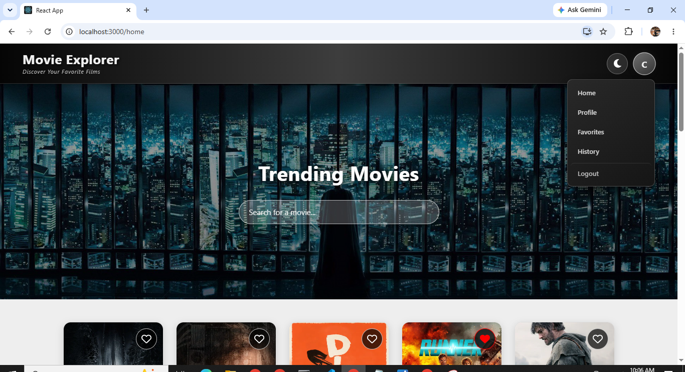
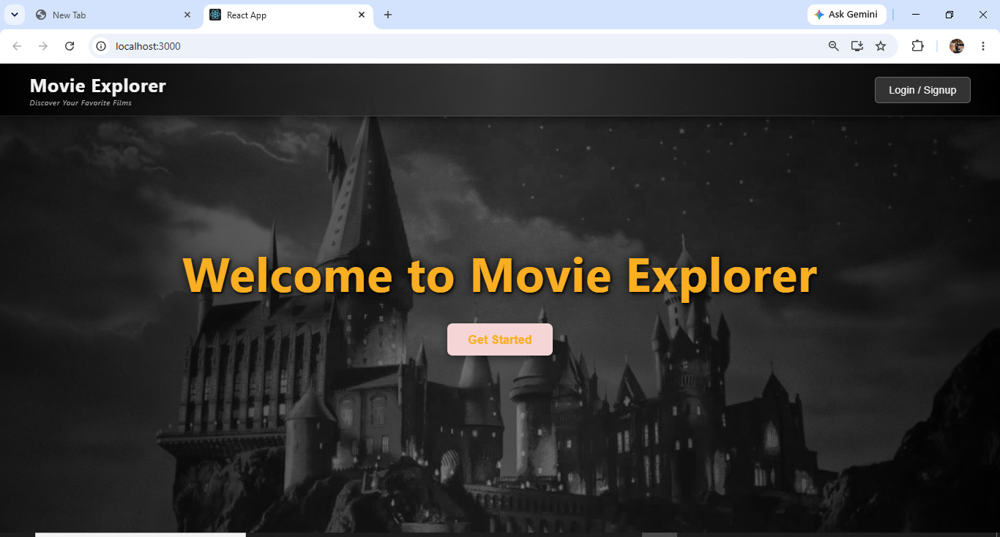
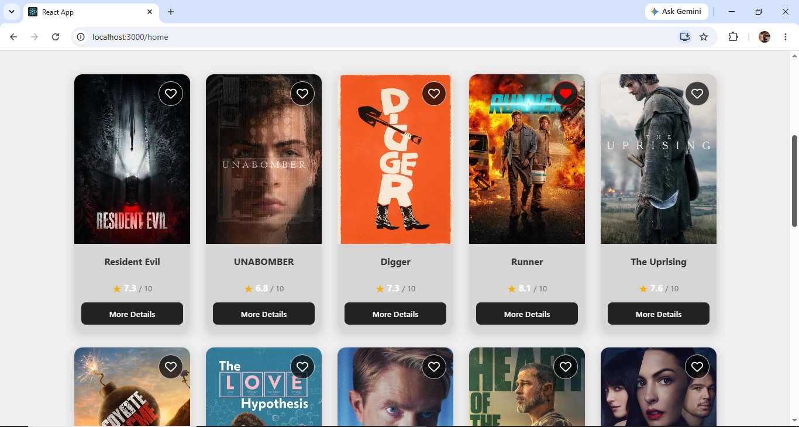
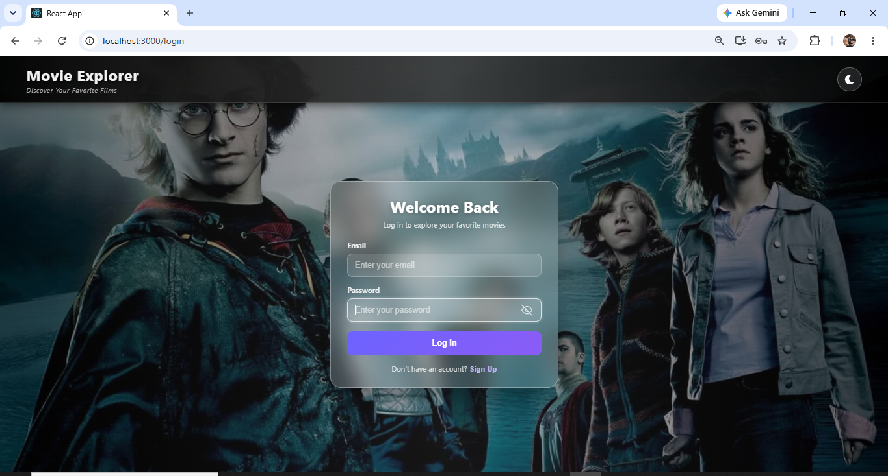
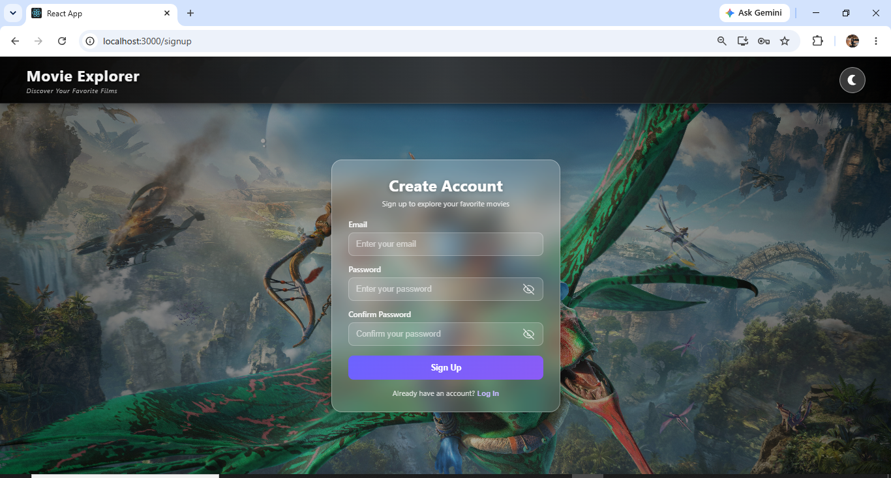
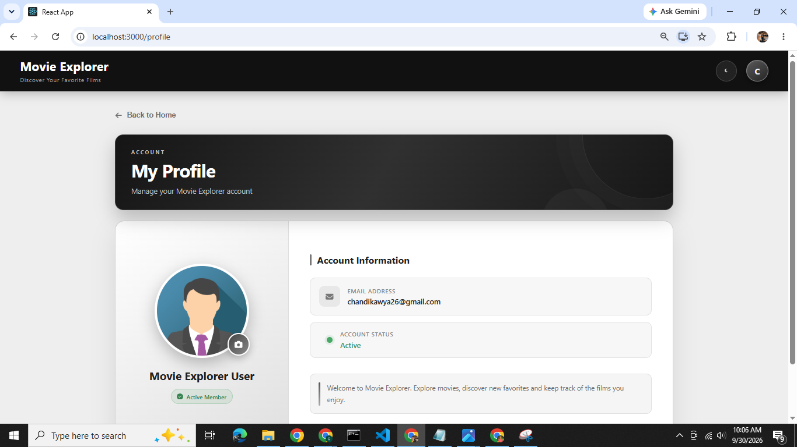
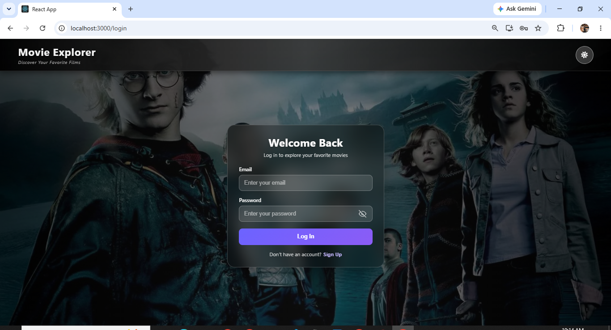
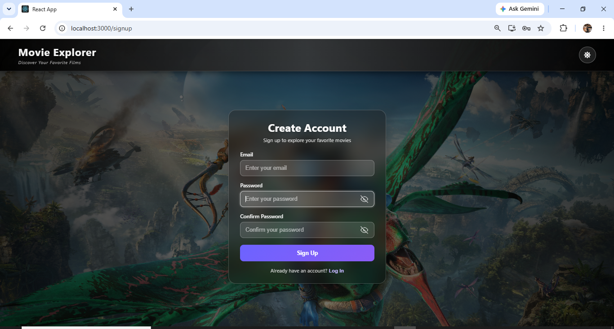
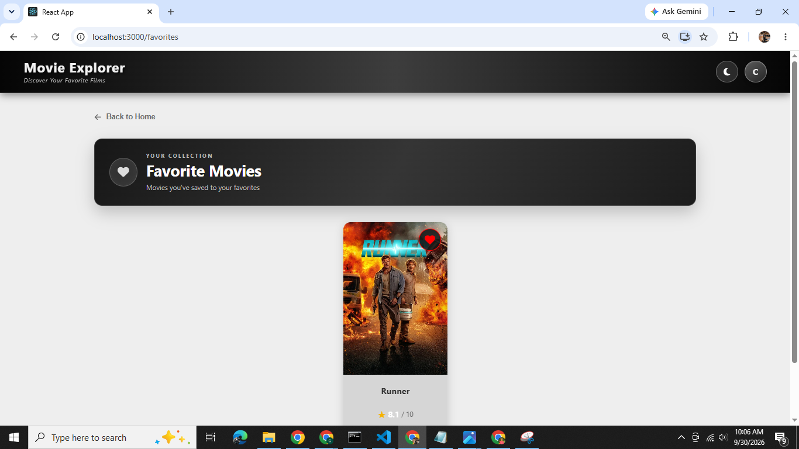

# 🎬 Movie Explorer – Discover Your Favorite Films

A feature-rich movie discovery app built with React, powered by the TMDb API, with Firebase authentication and user-specific favorites and history functionality.
- 🔗 Live Demo: https://movie-explorer-git-master-kawiws-projects.vercel.app/

---

## ✨ Features

- 🔐 User authentication using Firebase (Sign Up & Login)
- 🙍‍♂️ User profile page with account info and navigation to favorites/history etc.
- 🔎 Movie search with infinite scroll
- 📈 Display of trending movies
- 🎞️ Movie detail view (overview, genre, cast, trailer)
- 🌓 Light and dark mode toggle
- ❤️ Favorite movies list (per user)
- 🕘 Movie history (track viewed movies)
- 📁 Local storage of last search
- 🎬 Embedded trailers from YouTube or TMDb
- 🔍 Filter by genre, year, or rating (bonus)

 

## ⚙️ Project Setup
 - ###  Clone the repository
 - ###  Install dependencies
 - ###  TMDb API Setup
   - Visit https://www.themoviedb.org/ and create an account
   - Navigate to your API settings
   - Generate a new API Key (v3 auth)
 - ###  Firebase Setup
   - Go to Firebase Console
   - Create a project
   - Enable Authentication → Email/Password
   - Enable Cloud Firestore
  - ###  Start the development server

 

## 🛠️ Technologies

<table>
  <tr>
    <th>React</th>
    <th>Firebase</th>
    <th>TMDb API</th>
    <th>CSS3</th>
    <th>Vercel</th>
  </tr>
  <tr>
    <td></td>
    <td></td>
    <td></td>
    <td></td>
    <td></td>
  </tr>
</table>

 

## 📸 Screenshots

| Home Page | Landing Page | Movie Cards |
|-----------|--------------|-------------|
|  |  |  |

| Light Login | Light Signup | Profile Page |
|-------------|--------------|--------------|
|  |  |  |

| Dark Login | Dark Signup | Favourite Page |
|------------|-------------|----------------|
|  |  |  |
 

## 🌍 Deployment
- ✅ Deployed using vercel
- 🔗 Live Demo: https://movie-explorer-git-master-kawiws-projects.vercel.app/
